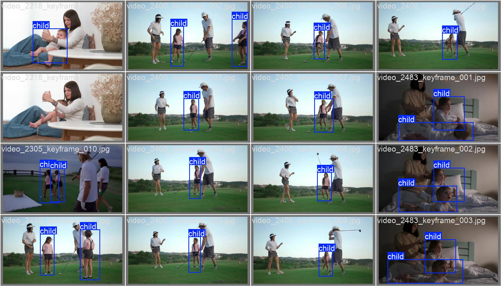

# Child Detection Dataset
The Child Detection Dataset (CDD) collected from pexel.com with bounding box annotations, used in our paper Fine tuned YOLO model for monitoring children across medical scenes based on a large scale real-world dataset for children detection. The data and annotations are released for research purpose only.

The dataset includes 1920 image of child collected on pexels.com. Images and annotations are available on this link.
The weights of the fine tuned YOLOCDD can be find in this repository.

# Citing Child Detection Dataset
if you find this dataset or model useful in your research, please consider citing our paper.
